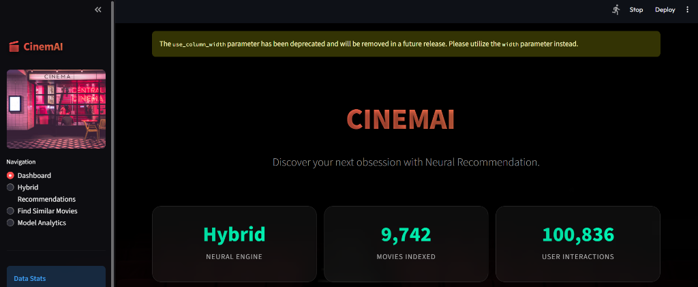
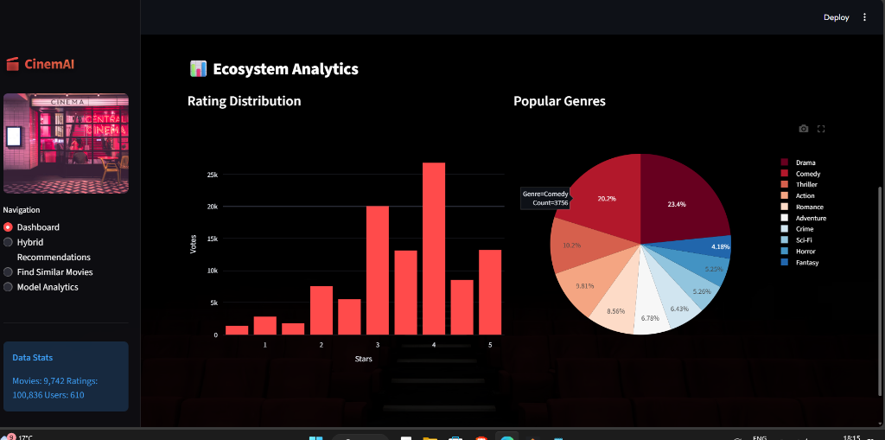
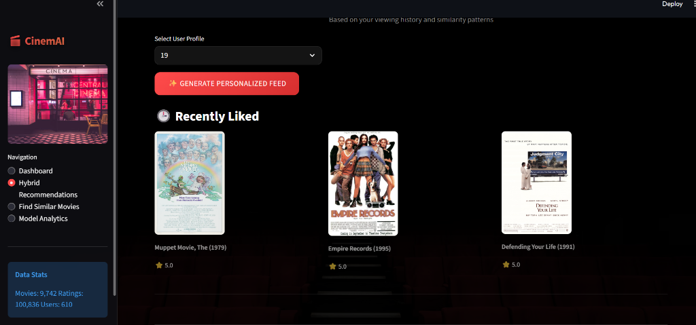
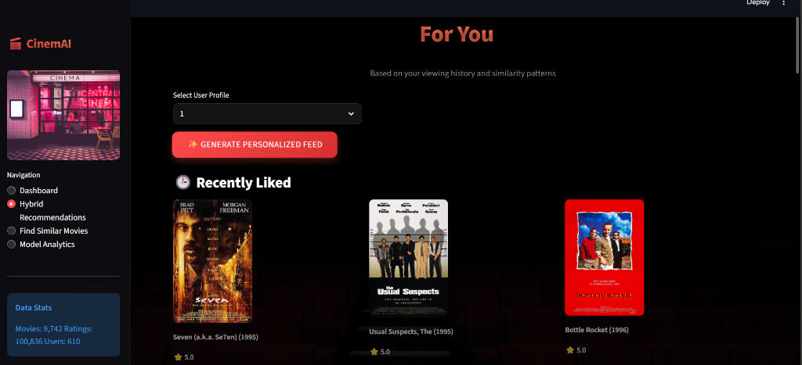

# 🎬 CinemAI - Next-Gen Movie Recommendation Engine


> **"Discover your next obsession."**  
> CinemAI is an enterprise-grade, hybrid recommendation system that combines value-driven data science with a premium user experience.

---

## 🌟 Overview

CinemAI isn't just a list of movies—it's an intelligent engine designed to understand user taste. By fusing **Collaborative Filtering** (SVD) with **Content-Based Filtering** (TF-IDF), it mitigates the "Cold Start" problem while providing deeply personalized suggestions for power users.

Built with a **modular architecture** similar to production systems at Netflix or Spotify, CinemAI offers a sleek, glassmorphic UI overlaying a robust machine learning backend.

## 📸 Project Gallery

| **Cinematic Dashboard** | **Interactive Analytics** |
|:---:|:---:|
|  |  |

| **Hybrid Recommendations** | **User History & Discovery** |
|:---:|:---:|
|  |  |

> *Visual Discovery Mode showing "For You" personalized feed*
> 

## ✨ Key Features

*   **🧠 Hybrid AI Engine**: Seamlessly blends Neural SVD (Matrix Factorization) and Content Vectorization for high-accuracy predictions.
*   **🎨 Premium UI/UX**: A darker, cinematic interface featuring glassmorphism, smooth transitions, and a "Netflix-style" browsing experience.
*   **⚡ Real-Time Poster Fetching**: Smart scraping from TMDB & IMDb ensures every recommendation comes with high-quality visual artwork.
*   **🔍 "Find Similar" Discovery**: A powerful content discovery tool that lets you explore the movie universe based on a single title you love.
*   **📊 Ecosystem Analytics**: Interactive dashboards powered by Plotly to visualize user trends, genre distributions, and model performance metrics (RMSE/MAE).
*   **🌐 Cloud-Native**: Docker-ready and configured for instant deployment on Render/Heroku.

## 🏗️ Technical Architecture

The system is organized into a clean, maintainable structure:

```
recommendation_engine/
├── app.py                 # 🚀 Main Application Entry Point (Streamlit)
├── src/
│   ├── data_loader.py     # 📥 Robust Data Ingestion & Caching
│   ├── preprocessing.py   # 🧹 Feature Engineering & NLP Vectorization
│   └── models/            # 🤖 ML Model Core
│       ├── collaborative.py # Matrix Factorization (Truncated SVD)
│       ├── content_based.py # TF-IDF & Cosine Similarity Engine
│       └── hybrid.py        # Weighted Ensemble Orchestrator
├── assets/                # 🖼️ Static Assets
└── requirements.txt       # 📦 Dependency Management
```

## 🚀 Getting Started

### Prerequisites
- Python 3.9 or higher
- pip (Python Package Installer)

### Installation

1.  **Clone the Repository**
    ```bash
    git clone https://github.com/madhavcodeer/cinemas.git
    cd cinemas
    ```

2.  **Install Dependencies**
    ```bash
    pip install -r requirements.txt
    ```

3.  **Launch the App**
    ```bash
    streamlit run app.py
    ```
    *Note: The first run will automatically download and cache the MovieLens dataset.*

## 📈 Model Performance

You can evaluate the model's accuracy in real-time via the **Model Analytics** tab.
-   **RMSE (Root Mean Squared Error)**: Measures prediction accuracy. Lower is better.
-   **Cold Start Handling**: Uses a popularity-weighted algorithm for new users.

## ☁️ Deployment

This project is optimized for deployment on **Render**.

1.  Push code to GitHub.
2.  Connect repository to [Render](https://render.com).
3.  Use the following settings:
    -   **Build Command**: `pip install -r requirements.txt`
    -   **Start Command**: `streamlit run app.py --server.port $PORT --server.address 0.0.0.0`
4.  Deploy! 🚀

---

### Credit
Developed with ❤️ by [Madhav Pachaury](https://github.com/madhavcodeer)
*Powered by the MovieLens 100k Dataset.*
